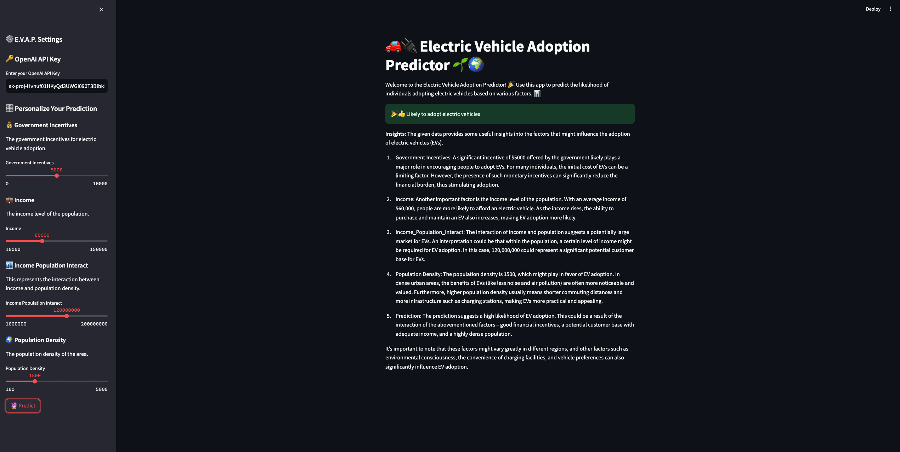

# Electric Vehicle Adoption Predictor

Welcome to the Electric Vehicle Adoption Predictor! This project predicts the likelihood of individuals adopting electric vehicles based on various factors such as government incentives, income, population density, and their interactions.

## Overview

The Electric Vehicle Adoption Predictor is built using Flask for the backend, with a machine learning model trained using XGBoost. It provides a simple REST API endpoint for predicting electric vehicle adoption.

## Features

- Predicts the likelihood of adopting electric vehicles.
- Easy-to-use REST API endpoint.
- Interactive Swagger documentation.
- AI-generated insights for prediction results.
- Emoji feedback for prediction results.
- Streamlit app for user-friendly interaction.
- Open-source and customizable.
- Easy to deploy and scale.
- Fast and efficient predictions.
- Supports multiple input features.
- Provides explanations for prediction results.
- Built with modern technologies and best practices.
- Well-documented and user-friendly.
- Beginner-friendly and easy to use.
- Fun and educational.

## Installation

To install and run the Electric Vehicle Adoption Predictor, follow these steps:

- Clone this repository:
- 

```bash

git clone https://github.com/bantoinese83/ev-adoption-predictor.git
```
cd ev-adoption-predictor
```
Update .env file with your OpenAI API key:
API_KEY=YOUR_OPENAI_API_KEY
```
- Create a virtual environment:

```bash
pip install -r requirements.txt
```

- Run the Flask application:

```bash
python ev_adoption_api.py
```

- Run the streamlit app:

```bash
streamlit run ev_adoption_streamlit.py
```

- Visit http://localhost:5000/apidocs/ in your web browser to interact with the API using Swagger.
- Use the Swagger documentation to test the API endpoint and make predictions.
- Enjoy predicting electric vehicle adoption!
- If you have any questions or feedback, feel free to reach out to us.
- Remember to star this repository if you find it useful!
- Thank you for using the Electric Vehicle Adoption Predictor!
-  Happy predicting!

## AI Insights

In addition to predicting electric vehicle adoption, this application also provides AI-generated insights on the prediction. These insights are generated using OpenAI's GPT-4 model and can provide additional context and understanding about the prediction.

## Emoji Feedback

To make the prediction results more user-friendly and intuitive, the application displays a thumbs up emoji (👍) for "Likely to adopt electric vehicles" and a thumbs down emoji (👎) for "Unlikely to adopt electric vehicles".

## Usage with AI Insights

Once the Flask application or Streamlit app is running, you can input the following features:

- Government_Incentives: Government incentives for electric vehicle adoption.
- Income: Income level of the population.
- Income_Population_Interact: Interaction between income and population density.
- Population_Density: Population density of the area.

After clicking the 'Predict' button, the application will display the prediction result along with the AI-generated insights. The prediction result will be displayed as a thumbs up emoji (👍) or a thumbs down emoji (👎), and the insights will be displayed as a text paragraph.

Example JSON data for Flask application:

```json
{
"Government_Incentives": 5000,
"Income": 60000,
"Income_Population_Interact": 120000000,
"Population_Density": 1500
}
```
The API will return a JSON response with the predicted electric vehicle adoption likelihood.

